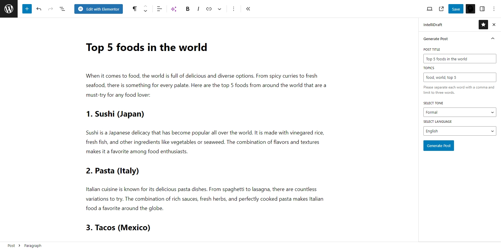
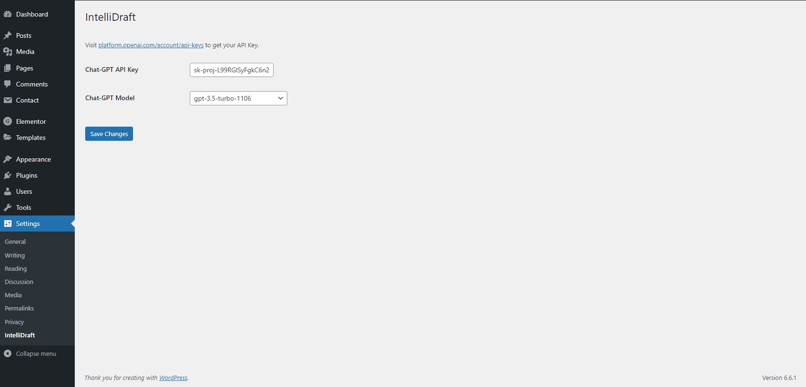

# IntelliDraft

**IntelliDraft** is a cutting-edge WordPress plugin that leverages the power of AI to revolutionize your content creation process. Whether you're a blogger, marketer, or site administrator, IntelliDraft helps you produce high-quality, engaging content effortlessly. Transform the way you create, manage, and optimize your WordPress site with AI-driven insights and automation.

## Features

### Version 1.0.0
- **Blog Post Generation**: Enter a title and topics, and IntelliDraft will generate a complete, well-structured blog post.

### Future Features
- **Blog Post Featured Image Creation**: Automatically generate relevant featured images for your posts.
- **Advanced Content Customization**: Refine the tone, style, and structure of your AI-generated content.
- **Additional SEO Tools**: Enhanced keyword integration and optimization features.

## Demo

*Generating a blog post about the top 5 food in the world.*

## Installation

1. Clone or download the `IntelliDraft` repository.
2. Upload the `intellidraft` folder to the `/wp-content/plugins/` directory of your WordPress site.
3. Activate the plugin through the 'Plugins' menu in WordPress.
4. Go to **Settings > IntelliDraft** to enter your ChatGPT API key, save the settings, and choose your preferred AI model. **This step is required for the plugin to work.**

## Usage

1. After setting up your API key, navigate to the IntelliDraft section in your WordPress editor.
2. Enter the title and topics for your blog post.
3. Click "Generate" to create a fully AI-generated blog post.

## Requirements

- WordPress 6.5 or higher
- PHP 7.4 or higher
- A valid ChatGPT API key

## Frequently Asked Questions

### How does IntelliDraft generate content?
IntelliDraft uses advanced AI technology powered by GPT-4 to generate content based on the title and topics you provide. The AI is designed to create well-structured, engaging, and SEO-friendly blog posts.

### Do I need an API key to use IntelliDraft?
Yes, you must create a ChatGPT API key and set it up in the plugin settings. Go to **Settings > IntelliDraft** in your WordPress dashboard to enter the API key and select your AI model.

### Can I customize the content generated by IntelliDraft?
Yes, you can provide specific titles and topics to guide the content generation process. Future versions of the plugin will offer even more customization options, including tone and style adjustments.

### Is IntelliDraft compatible with all WordPress themes?
IntelliDraft is designed to work seamlessly with most WordPress themes and plugins. If you encounter any compatibility issues, please contact our support team.

## Contributing

Contributions are welcome! Please fork this repository and submit a pull request with your changes. For major changes, please open an issue first to discuss what you would like to change.

## License

IntelliDraft is licensed under the GPLv3. See the [LICENSE](https://www.gnu.org/licenses/gpl-3.0.html) file for more details.

## Screenshots

*The IntelliDraft Dashboard, where you can generate AI-powered blog posts.*

*Settings page for entering your ChatGPT API key and selecting the AI model.*

## Support

For support, please open an issue on GitHub or visit the WordPress plugin repository page.

## Roadmap

- **Version 1.1.0**: Blog post featured image creation, advanced content customization, and additional SEO tools.
